<div align="center">

# Skillora

**A peer-to-peer skill exchange platform that matches people who can teach each other.**


[Demo video](docs/Demo_video.mp4) · [API reference](docs/API.md) · [Screenshots](#screenshots) · [Getting started](#getting-started)

</div>

> **Final Year Project**
> Author: `<Your Name>` · Programme: `<Degree / Course>` · Institution: `<University>` · Supervisor: `<Supervisor Name>` · Year: `<Year>`

---

## Table of Contents

1. [Overview](#overview)
2. [Screenshots](#screenshots)
3. [Key Features](#key-features)
4. [Tech Stack](#tech-stack)
5. [System Architecture](#system-architecture)
6. [How Matching Works](#how-matching-works)
7. [Getting Started](#getting-started)
8. [Demo Accounts](#demo-accounts)
9. [Testing](#testing)
10. [API Documentation](#api-documentation)
11. [Configuration](#configuration)
12. [Deployment](#deployment)
13. [Design Decisions](#design-decisions)
14. [Security Considerations](#security-considerations)
15. [Limitations and Future Work](#limitations-and-future-work)
16. [Author and License](#author-and-license)

---

## Overview

Skillora lets members list the skills they can **teach** and the skills they want to **learn**. The platform then
suggests people whose skills complement theirs, so each side gives and receives knowledge without money changing
hands. Matched members can message each other, schedule sessions, review one another, and earn XP as they progress.

### Objectives

- Build a complete full-stack application that covers the whole exchange lifecycle, from discovery to review.
- Design a **transparent, explainable** matching algorithm that does not depend on an external AI service.
- Apply production-oriented practices: layered architecture, database migrations, stateless authentication,
  input validation, automated tests, and containerised deployment.

### Example

You teach **SQL** and want to learn **Spring Boot**. Another member teaches **Spring Boot** and wants to learn
**SQL**. Skillora scores this as a full reciprocal match and explains it in plain English:
*"You can teach SQL while learning Spring Boot."*

---

## Screenshots

| | |
|---|---|
| **Landing**<br>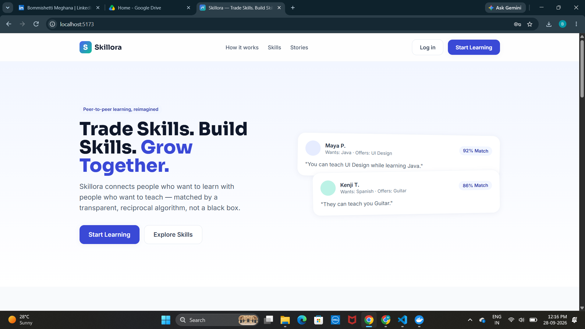 | **Login**<br>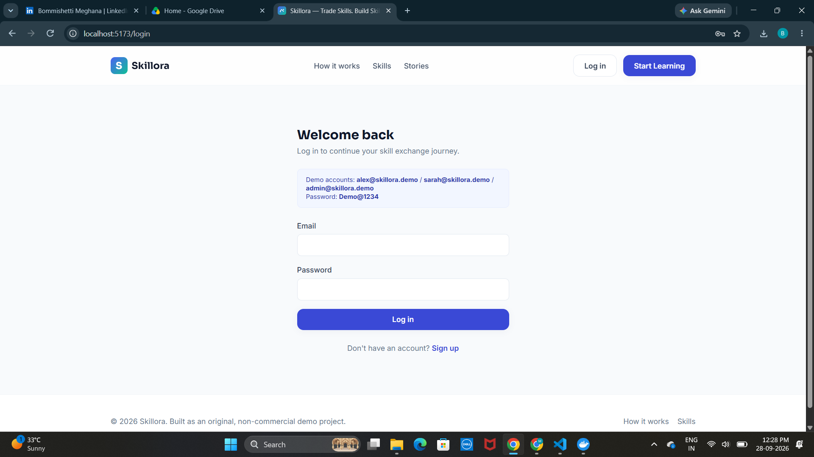 |
| **Register**<br>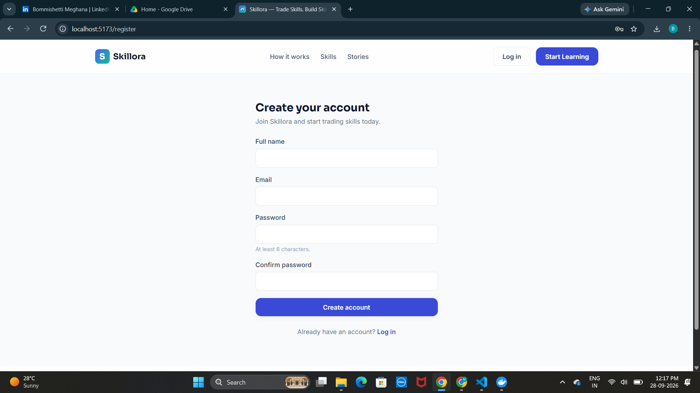 | **Dashboard**<br>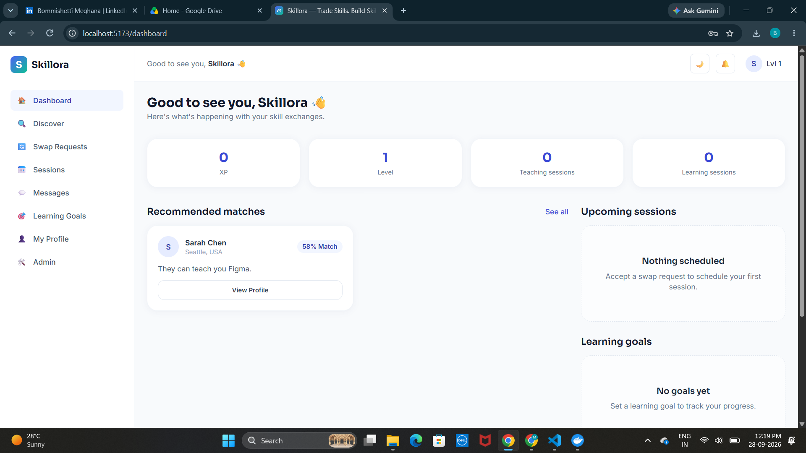 |
| **Discover**<br>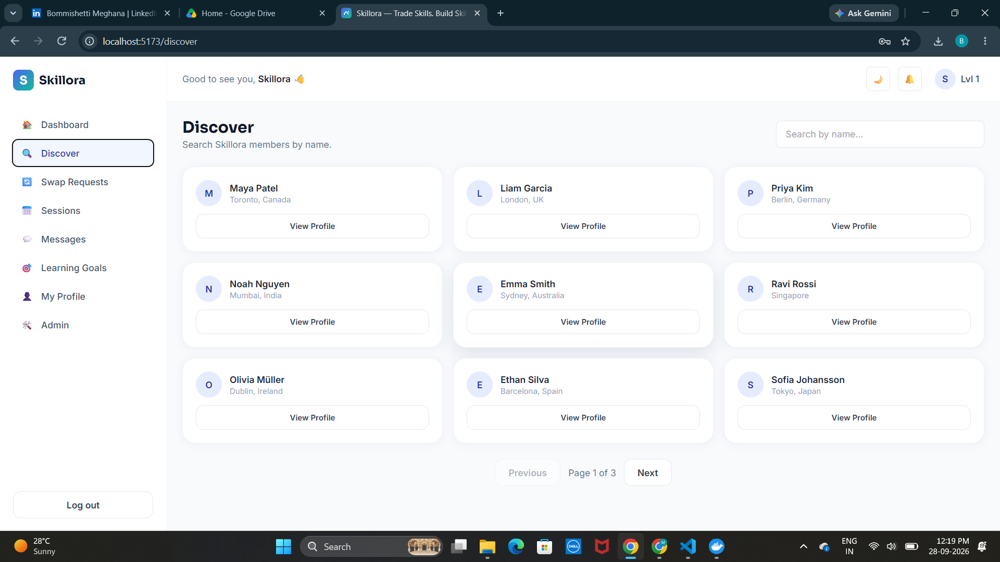 | **Swap requests**<br>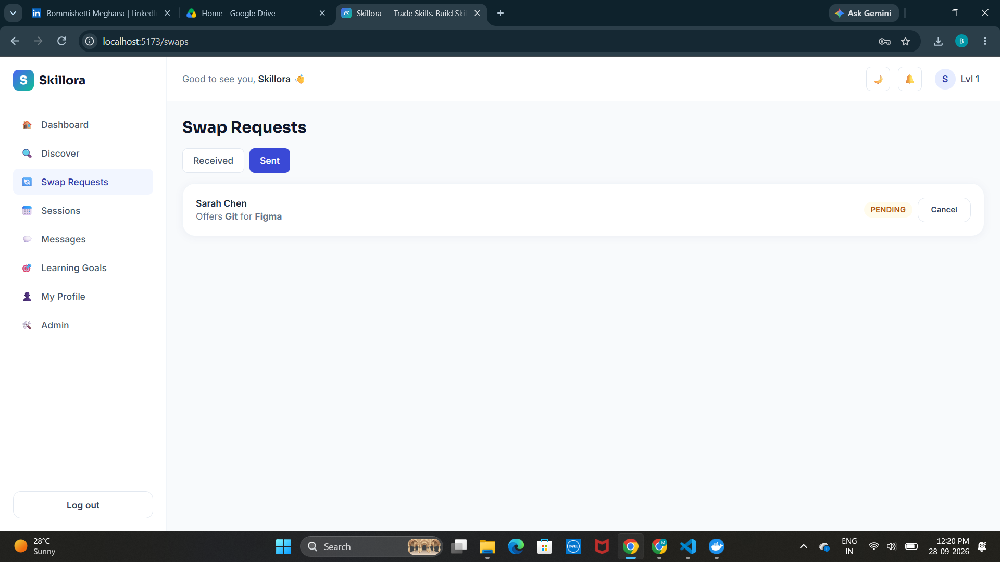 |
| **Swap request**<br>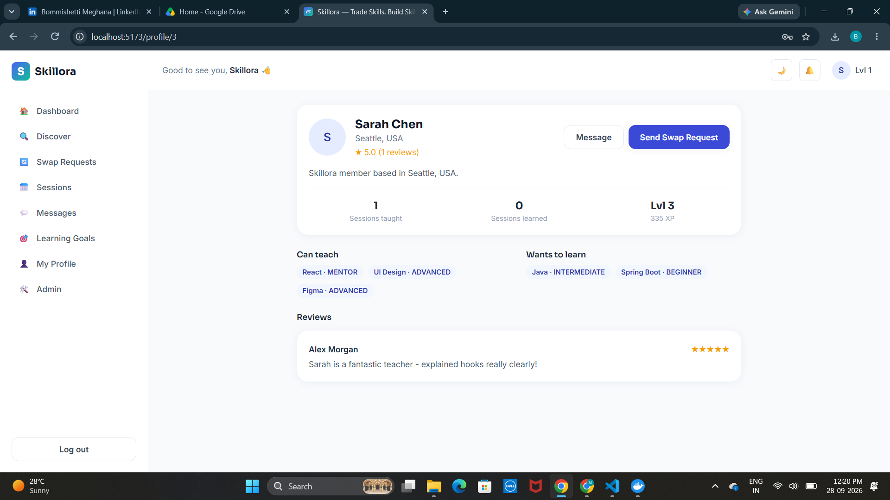 | **Sessions**<br>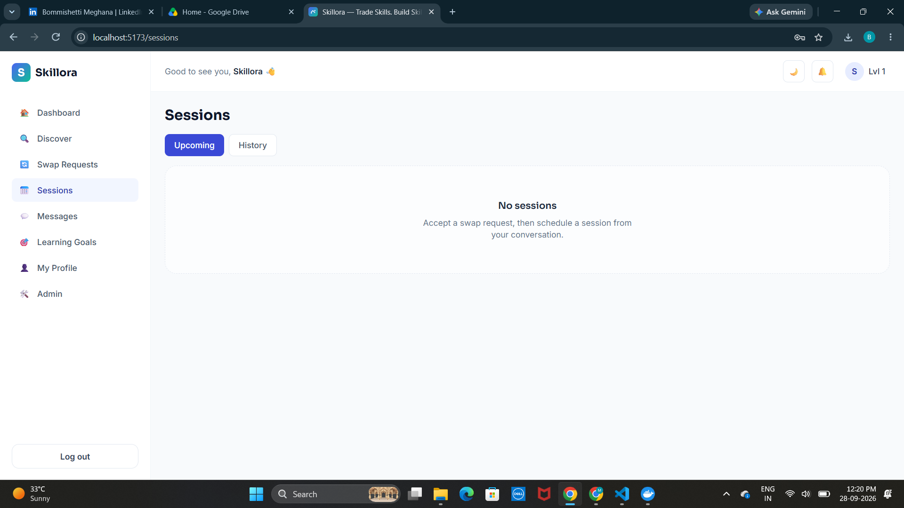 |
| **Messages**<br>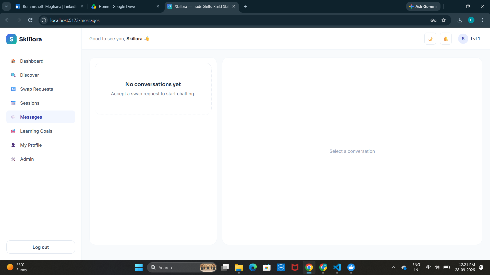 | **Learning goals**<br>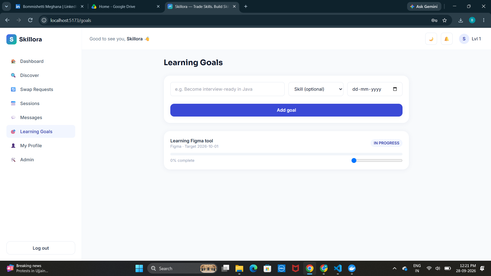 |
| **Notifications**<br>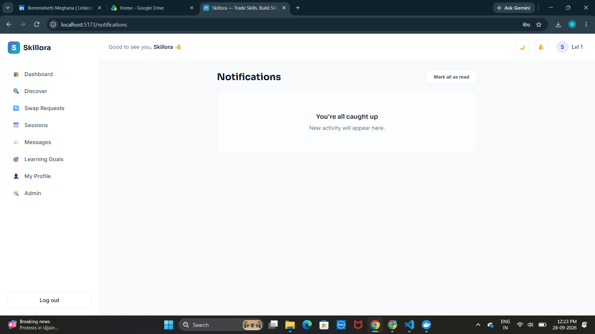 | **Dark mode**<br>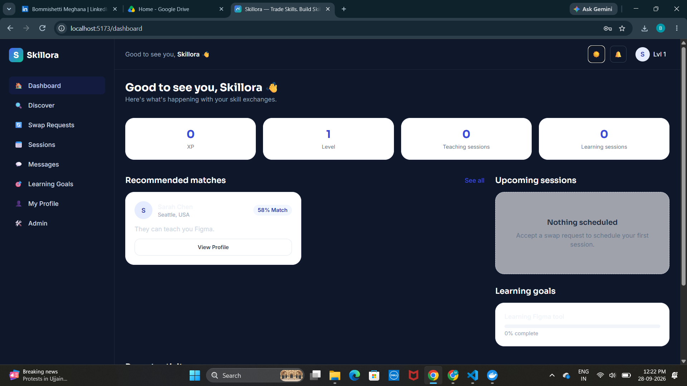 |
| **Admin dashboard**<br>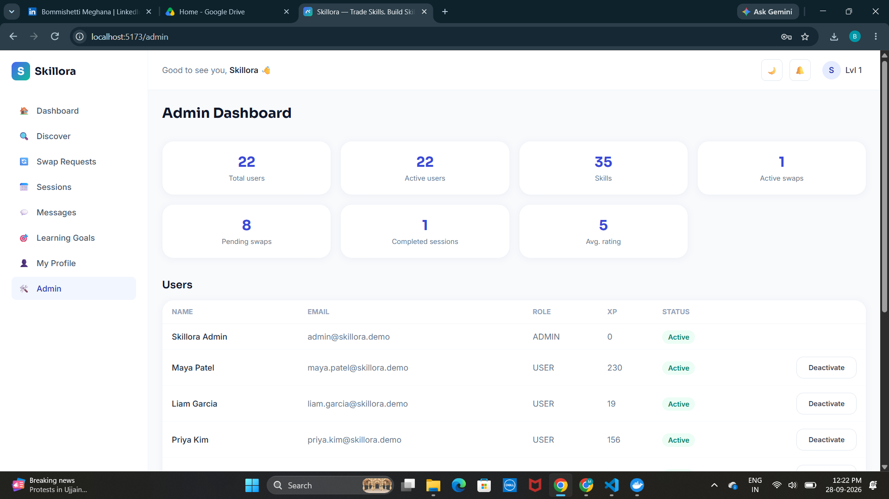 | |

A full walkthrough of the running application is available in [docs/Demo_video.mp4](docs/Demo_video.mp4).

---

## Key Features

| Area | Description |
|---|---|
| **Authentication** | Registration and login with BCrypt-hashed passwords and JWT. `USER` and `ADMIN` roles. |
| **Onboarding** | Six skippable steps: profile, skills to teach, skills to learn, experience, availability, goal. |
| **Skills catalogue** | 35 seeded skills across 10 categories. |
| **Reciprocal matching** | A weighted 100-point score computed in Java, with a per-signal breakdown and a plain-English explanation. |
| **Swap requests** | Send, accept, reject and cancel. Accepting a request opens a conversation. |
| **Messaging** | Conversations, message history, unread counts and read status (REST polling). |
| **Sessions** | Request, confirm, complete or cancel. The backend enforces valid status transitions, and the scheduler shows an availability overlap hint. |
| **Reviews** | 1-5 stars after a completed session. One review per person per session. Updates reputation. |
| **XP and levels** | Gamified progression across five levels (see below). |
| **Notifications** | Swap, message, session, review and XP events, with mark-as-read. |
| **Learning goals** | Create goals and track progress. |
| **Discover** | Search members by name, with pagination. |
| **Admin** | Platform statistics, user list, and activate/deactivate with an audit record. |
| **UX** | Dark mode (remembered), responsive layout, and Swagger API documentation. |

### XP and levels

| Event | XP |
|---|---|
| Complete a session (both participants) | +50 |
| Receive a 5-star review | +25 |
| Complete your profile | +20 |

| Level | 1 | 2 | 3 | 4 | 5 |
|---|---|---|---|---|---|
| **Threshold (XP)** | 0 | 100 | 250 | 500 | 1000 |

---

## Tech Stack

| Layer | Technology |
|---|---|
| **Frontend** | React, Vite, Tailwind CSS |
| **Backend** | Java 21, Spring Boot 3, Spring Data JPA |
| **Security** | Spring Security, JWT, BCrypt |
| **Database** | PostgreSQL 16, Flyway migrations |
| **API docs** | OpenAPI / Swagger UI |
| **Testing** | JUnit and Spring Boot Test with in-memory H2 |
| **DevOps** | Docker, Docker Compose, nginx, Render, Vercel |
| **Tooling** | Playwright script for recording screenshots and demo video |

---

## System Architecture

Skillora is a **modular monolith**: a single deployable backend organised in layers, with one relational database.

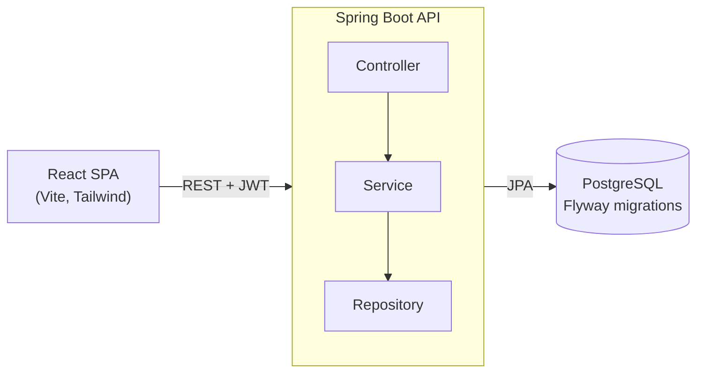

**Backend packages:** `controller`, `service`, `repository`, `entity`, `dto`, `mapper`, `security`, `exception`, `config`.

### Repository structure

```
skillora/
├── backend/            Spring Boot API, Flyway migration, tests, Dockerfile
├── frontend/           React app, nginx config, Dockerfile, vercel.json
├── docs/               API reference and demo video
├── screenshots/        README images
├── scripts/            Playwright script that records screenshots and video
├── docker-compose.yml
└── .env.example
```

---

## How Matching Works

For every candidate, `MatchService` adds up six weighted signals for a total of **100 points**. No external AI
service is used, so every score can be traced and explained.

| Signal | Weight | Meaning |
|---|---:|---|
| Skill compatibility | 40 | How much of what each person wants the other can teach |
| Reciprocal potential | 20 | Full credit if both can teach each other, partial if only one can |
| Experience fit | 15 | Whether the teacher's level meets the learner's target level |
| Availability overlap | 10 | Shared words in both free-text availabilities |
| Reputation | 10 | The candidate's average review rating |
| Activity | 5 | Accumulated XP |

---

## Getting Started

### Option 1: Docker (recommended)

**Requirements:** Docker Desktop.

```bash
docker compose up --build
```

| Service | URL |
|---|---|
| Frontend | http://localhost:5173 |
| Backend API | http://localhost:8080 |
| Swagger UI | http://localhost:8080/swagger-ui/index.html |

Demo data is created automatically on first start.

```bash
docker compose down        # stop
docker compose down -v     # stop and wipe the database
```

<details>
<summary><strong>Port already in use?</strong></summary>

Copy `.env.example` to `.env` and change `BACKEND_PORT` and/or `FRONTEND_PORT`.

- If you change `BACKEND_PORT`, set `VITE_API_BASE_URL` to the same port.
- If you change `FRONTEND_PORT`, add `http://localhost:<port>` to `CORS_ALLOWED_ORIGINS`.

Then run `docker compose up --build` again.
</details>

### Option 2: Run locally without Docker

**Requirements:** Java 21, Maven 3.9+, Node 20, PostgreSQL 16.

```bash
# 1. Create a PostgreSQL database and user, both named "skillora" (password "skillora")

# 2. Backend (http://localhost:8080)
cd backend
mvn spring-boot:run

# 3. Frontend (http://localhost:5173), in a second terminal
cd frontend
cp .env.example .env
npm install
npm run dev
```

If your database settings differ, the backend reads `DATABASE_URL`, `DATABASE_USERNAME` and `DATABASE_PASSWORD`.

---

## Demo Accounts

Seeded on first start: 21 members with sample swaps, sessions, a review and goals.

| Role | Email | Password |
|---|---|---|
| Admin | `admin@skillora.demo` | `Demo@1234` |
| Member | `alex@skillora.demo` | `Demo@1234` |
| Member | `sarah@skillora.demo` | `Demo@1234` |

Other seeded members use `firstname.lastname@skillora.demo` with the same password.
Set `SEED_ENABLED=false` to disable demo data.

---

## Testing

```bash
cd backend
mvn test
```

Tests run against an in-memory H2 database and cover:

- Registration and login
- JWT-protected access
- The matching algorithm
- The swap → session → review lifecycle

Frontend tests are not yet implemented (see [Limitations and Future Work](#limitations-and-future-work)).

---

## API Documentation

- **Interactive docs:** `/swagger-ui/index.html`. Choose **Authorize** and paste the token returned by `POST /api/auth/login`.
- **Endpoint summary:** [docs/API.md](docs/API.md)

All errors use a single consistent format:

```json
{
  "success": false,
  "message": "Human readable message",
  "timestamp": "...",
  "path": "/api/..."
}
```

---

## Configuration

| Variable | Purpose | Default |
|---|---|---|
| `DATABASE_URL` | JDBC URL, e.g. `jdbc:postgresql://host:5432/skillora` | `jdbc:postgresql://localhost:5432/skillora` |
| `DATABASE_USERNAME` | Database user | `skillora` |
| `DATABASE_PASSWORD` | Database password | `skillora` |
| `JWT_SECRET` | Token signing key, at least 32 characters | development placeholder |
| `JWT_EXPIRATION_MS` | Token lifetime | `86400000` (24 hours) |
| `CORS_ALLOWED_ORIGINS` | Comma-separated allowed frontend origins | `http://localhost:5173` |
| `SEED_ENABLED` | Load demo data when the database is empty | `true` |
| `DEMO_PASSWORD` | Password for seeded accounts | `Demo@1234` |
| `VITE_API_BASE_URL` | Backend URL used by the frontend (set at build time) | `http://localhost:8080` |

> **Important:** always set your own `JWT_SECRET` outside local development, and never commit a real `.env` file.

---

## Deployment

### Backend and database on Render

1. Create a **PostgreSQL** database on Render.
2. Create a **Web Service** from this repository with runtime **Docker**, root directory `backend`, and health check path `/actuator/health`.
3. Add these environment variables:

   | Variable | Value |
   |---|---|
   | `DATABASE_URL` | `jdbc:postgresql://<host>:5432/<database>` (JDBC format, not `postgres://`) |
   | `DATABASE_USERNAME` / `DATABASE_PASSWORD` | Taken from the Render database |
   | `JWT_SECRET` | A long random string |
   | `CORS_ALLOWED_ORIGINS` | Your Vercel URL, with no trailing slash |
   | `SPRING_PROFILES_ACTIVE` | `prod` |
   | `SEED_ENABLED` | `true` for a demo, `false` otherwise |

Flyway creates the schema on first start. Demo data loads only when the users table is empty.

### Frontend on Vercel

1. Import the repository and set the root directory to `frontend` (framework preset: Vite).
2. Add the environment variable `VITE_API_BASE_URL` set to your Render service URL.
3. Deploy. `vercel.json` already sets the build command and single-page-app routing.
4. Add the final Vercel URL to `CORS_ALLOWED_ORIGINS` on Render and redeploy the backend.

---

## Design Decisions

| Decision | Rationale |
|---|---|
| **Modular monolith** | One deployable and one database keeps the project simple. Microservices would add operational cost with no benefit at this size. |
| **PostgreSQL** | The data is relational (users, skills, swaps, sessions, reviews) and benefits from constraints, indexes and transactions. |
| **Flyway migrations** | Versioned, repeatable schema changes across local, test and production environments. |
| **Rule-based matching** | A weighted score is transparent, testable and explainable to users, with no dependency on an external AI service. |
| **REST polling for messages** | Simpler to build and deploy than WebSockets, and adequate for a demo-scale workload. |
| **Server-enforced status transitions** | Sessions and swaps can only move through valid states, so the API stays consistent regardless of the client. |

---

## Security Considerations

**Implemented**

- BCrypt password hashing
- Stateless JWT authentication with role-based access control (`USER`, `ADMIN`)
- Request validation and a uniform error format
- CORS restricted to configured origins

**Known trade-offs**

- The JWT is stored in `localStorage`, which is simple but exposed to XSS. httpOnly cookies would be stronger.
- There is no rate limiting yet.

---

## Limitations and Future Work

### Not implemented yet

- Badges and streak XP
- Trust score breakdown and a dedicated skill passport page (the public profile at `/profile/{id}` is the closest equivalent)
- Discover filters beyond name search
- Admin UI for skill management, reports and announcements (skill create/edit/delete exists as an API)
- Email notifications, session reminders, WebSockets and frontend tests

### Known limits

- Matches are scored in memory per request. This is fine for a demo and is the first thing to optimise at scale.
- Availability overlap is a simple word comparison rather than real calendar logic.

### Roadmap

- [ ] Rate limiting and httpOnly cookie authentication
- [ ] Structured availability with calendar integration
- [ ] Semantic skill matching
- [ ] WebSocket messaging and email notifications
- [ ] Session reminders and video calls
- [ ] Frontend unit and end-to-end tests

---

## Author and License

**`<Meghana Bommishetti>`** · [GitHub](https://github.com/meghana5226) · [LinkedIn](https://www.linkedin.com/in/bommishetti-meghana-0a3875289/) · `<bommishettimeghana5226@gmail.com>`

